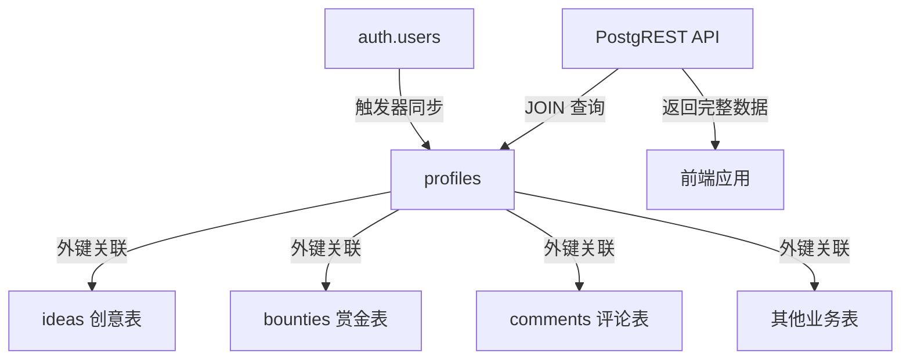

## 产品概览

修复数据库外键引用问题,将所有表的外键从 `auth.users(id)` 改为 `profiles(id)`,确保 PostgREST API 能够正确执行 JOIN 查询,彻底解决创意和赏金任务发布失败的问题。

## 核心功能

- 重建数据库表结构,确保所有用户关联外键指向 `profiles(id)`
- 保持 `profiles` 表与 `auth.users` 的触发器同步机制
- 验证 PostgREST API 查询能正确返回用户信息
- 确保创意和赏金任务发布功能正常运行

## 技术栈

- 数据库: Supabase PostgreSQL
- API 层: PostgREST (Supabase 自动生成)
- 认证系统: Supabase Auth

## 技术架构

### 系统架构

采用 Supabase 标准架构模式,通过 `profiles` 表作为用户信息的中心节点,所有业务表通过外键关联 `profiles(id)` 而非直接关联 `auth.users(id)`。



### 模块划分

- **核心表模块**: `profiles` 表作为用户信息中心,包含昵称、头像等扩展字段
- **业务表模块**: `ideas`、`bounties`、`comments` 等表,通过外键关联 `profiles`
- **同步机制模块**: 触发器确保 `auth.users` 新用户自动在 `profiles` 创建记录
- **权限控制模块**: RLS 策略确保数据访问安全

### 数据流

用户注册 → `auth.users` 新增记录 → 触发器自动创建 `profiles` 记录 → 业务操作关联 `profiles(id)` → PostgREST API JOIN 查询返回完整用户信息

## 实施细节

### 核心目录结构

```
supabase/
├── migrations/
│   └── 20240XXX_fix_foreign_keys.sql  # 新增: 修复外键引用的迁移文件
```

### 关键代码结构

**Profiles 表结构**: 用户信息扩展表,作为所有业务表的外键关联目标。

```sql
-- 核心 profiles 表
CREATE TABLE profiles (
  id UUID PRIMARY KEY REFERENCES auth.users(id) ON DELETE CASCADE,
  username TEXT UNIQUE,
  avatar_url TEXT,
  created_at TIMESTAMPTZ DEFAULT NOW()
);
```

**外键关联模式**: 业务表统一关联 profiles 而非 auth.users。

```sql
-- 业务表外键示例
CREATE TABLE ideas (
  id UUID PRIMARY KEY DEFAULT gen_random_uuid(),
  user_id UUID REFERENCES profiles(id) ON DELETE CASCADE,
  -- 其他字段
);
```

**触发器同步机制**: 确保 auth.users 新用户自动创建 profiles 记录。

```sql
-- 自动创建 profile 触发器
CREATE TRIGGER on_auth_user_created
  AFTER INSERT ON auth.users
  FOR EACH ROW EXECUTE FUNCTION handle_new_user();
```

### 技术实施计划

#### 1. 数据库表结构重建

**问题陈述**: 现有表外键引用 `auth.users(id)`,导致 PostgREST 无法 JOIN `profiles` 获取用户昵称等信息

**解决方案**: 删除现有业务表,重新创建时外键指向 `profiles(id)`

**关键技术**: PostgreSQL DDL、外键约束、级联删除

**实施步骤**:

1. 备份现有表结构(记录创建语句)
2. 删除所有业务表(ideas、bounties、comments 等)
3. 重新创建表,外键改为 `REFERENCES profiles(id)`
4. 验证外键约束正确性

**测试策略**: 使用 SQL 查询验证外键约束指向 `profiles` 表

#### 2. 触发器和 RLS 策略配置

**问题陈述**: 需要确保 `auth.users` 新用户自动在 `profiles` 创建记录,且权限控制正确

**解决方案**: 创建触发器函数和 RLS 策略

**关键技术**: PostgreSQL 触发器、RLS(Row Level Security)

**实施步骤**:

1. 创建 `handle_new_user()` 触发器函数
2. 绑定触发器到 `auth.users` 的 INSERT 事件
3. 配置 `profiles` 表的 RLS 策略(读公开、写本人)
4. 配置业务表的 RLS 策略

**测试策略**: 注册新用户验证 `profiles` 自动创建;测试不同用户访问权限

#### 3. PostgREST API 查询验证

**问题陈述**: 需要验证 API 能正确 JOIN `profiles` 返回用户信息

**解决方案**: 使用 Supabase 客户端测试关联查询

**关键技术**: PostgREST 内嵌资源(Embedded Resources)语法

**实施步骤**:

1. 测试 `ideas` 表查询时嵌入 `profiles` 数据
2. 测试 `bounties` 表查询时嵌入 `profiles` 数据
3. 验证返回数据包含用户昵称、头像等信息
4. 测试创建操作是否成功

**测试策略**: 编写测试用例,验证 API 返回数据结构正确

### 集成点

- **Supabase Auth**: 用户注册后触发器自动创建 `profiles` 记录
- **PostgREST API**: 通过 `?select=*,profiles(*)` 语法嵌入关联查询
- **前端应用**: 调用 Supabase 客户端 API 进行数据操作

## 技术考量

### 日志

- 遵循 Supabase 日志规范,关键操作记录到 PostgreSQL 日志

### 性能优化

- 在 `profiles(id)` 上创建索引(主键自动索引)
- 业务表外键列创建索引加速 JOIN 查询
- 使用 PostgREST 的选择性字段查询减少数据传输

### 安全措施

- RLS 策略确保用户只能修改自己的 `profiles` 记录
- 业务表 RLS 策略控制创建、修改、删除权限
- 使用 Supabase JWT 认证确保 API 调用安全

### 可扩展性

- `profiles` 表可随时添加新字段(如简介、社交链接等)
- 新业务表统一关联 `profiles(id)` 保持架构一致性
- 触发器机制确保用户系统扩展的灵活性