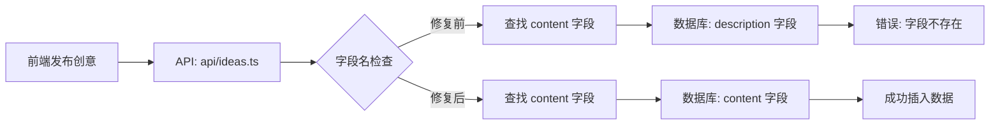

## 产品概述

修复数据库表结构与前端代码的字段名不一致问题，解决创意发布功能失败的错误。

## 核心功能

- 将 ideas 表的 description 字段重命名为 content
- 将 ideas 表的 likes 字段重命名为 likes_count
- 确保数据库字段与 API 代码一致
- 保留现有数据完整性

## 技术栈

- 数据库: PostgreSQL/MySQL（根据项目实际使用）
- 后端: Node.js + TypeScript
- ORM/数据库工具: Prisma/TypeORM/原生 SQL（根据项目实际使用）

## 技术架构

### 问题分析

当前问题源于数据库表结构与 API 代码的字段命名不匹配：

- API 代码（api/ideas.ts）使用字段: `content`, `likes_count`
- 数据库表（ideas）使用字段: `description`, `likes`
- 错误信息: "Could not find the 'content' column of 'ideas' in the schema cache"

### 解决方案

**方案选择：重命名数据库字段**

- 保持 API 代码不变
- 修改数据库表结构，将字段名改为与代码一致
- 使用数据库迁移脚本确保数据安全

### 数据流



## 实现细节

### 核心目录结构

```
project-root/
├── prisma/
│   └── migrations/
│       └── [timestamp]_rename_ideas_columns/
│           └── migration.sql    # 新增：字段重命名迁移脚本
└── api/
    └── ideas.ts                 # 现有：保持不变
```

### 关键代码结构

**数据库迁移脚本（migration.sql）**：执行字段重命名操作，确保数据完整性和原子性。使用 ALTER TABLE 语句重命名列，保留所有现有数据和约束。

```sql
-- 重命名字段
ALTER TABLE ideas RENAME COLUMN description TO content;
ALTER TABLE ideas RENAME COLUMN likes TO likes_count;
```

### 技术实施方案

#### 问题说明

- **当前状态**: API 代码期望 `content` 和 `likes_count` 字段，但数据库使用 `description` 和 `likes`
- **解决策略**: 使用数据库迁移脚本重命名字段，保持数据完整性

#### 实施步骤

1. **备份数据库**: 在执行迁移前创建数据库备份
2. **创建迁移脚本**: 编写 SQL 脚本重命名字段
3. **执行迁移**: 运行迁移脚本更新数据库表结构
4. **验证修复**: 测试创意发布功能确保正常工作
5. **清理缓存**: 如果使用了 schema 缓存，清理缓存确保使用新结构

#### 测试策略

- 迁移前后数据一致性检查
- 创意发布功能端到端测试
- 验证现有创意数据可正常读取和显示

### 集成点

- 数据库迁移工具（Prisma Migrate / TypeORM Migration / 手动 SQL）
- API 接口 `api/ideas.ts` 保持不变
- 前端代码无需修改

## 技术考虑

### 日志记录

- 迁移执行前后记录日志
- 记录受影响的行数

### 性能优化

- 在低峰时段执行迁移
- 对于大表考虑分批迁移或使用在线 DDL

### 安全措施

- 迁移前完整备份数据库
- 在测试环境先验证迁移脚本
- 准备回滚方案

### 可扩展性

- 使用版本化迁移脚本，便于追踪数据库变更历史
- 文档记录字段重命名原因和时间

## 智能体扩展

### SubAgent

- **code-explorer**
- 目的: 探索项目中所有使用 ideas 表字段的代码位置，确保没有遗漏的字段引用
- 预期结果: 列出所有引用 description、likes、content、likes_count 字段的文件和代码行，确认修改范围