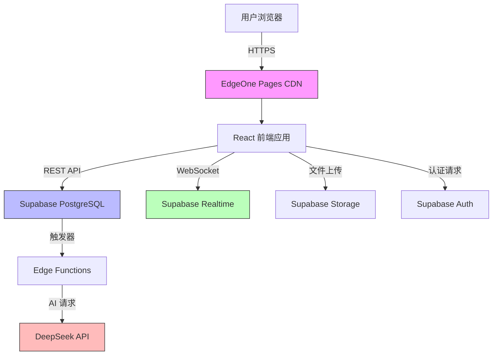
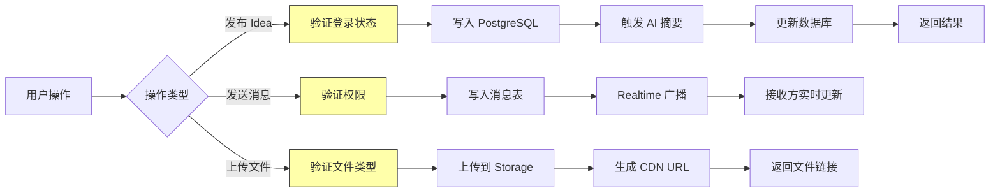

## 产品概述

为 Vibe Your Mind 社区构建完整的后端系统,采用全托管免费方案(Supabase + DeepSeek API),支持用户认证、数据持久化、实时聊天、文件上传等核心功能,并将前端部署到 EdgeOne Pages。系统设计支持 100-1000 人规模的中型社区。

## 核心功能

- **用户认证系统**: 邮箱注册/登录、第三方 OAuth(Google/GitHub)、JWT 令牌管理、用户资料编辑
- **Idea 管理**: 创建、编辑、删除、点赞、收藏、分类标签、搜索过滤
- **评论系统**: 多级评论、点赞、@提及、通知推送
- **实时聊天**: 秒级消息传递、在线状态、消息历史、群组聊天
- **赏金任务**: 发布任务、接受任务、任务状态追踪、积分系统
- **文件上传**: 图片/视频上传、缩略图生成、存储管理、CDN 加速
- **AI 集成**: DeepSeek API 用于内容推荐、智能回复、摘要生成

## 技术栈选型

- **后端服务**: Supabase(全托管 PostgreSQL + 实时订阅 + 身份认证 + 存储)
- **AI API**: DeepSeek API(经济高效的 LLM 服务)
- **前端部署**: EdgeOne Pages(腾讯云全球 CDN 加速)
- **前端框架**: React + TypeScript + Tailwind CSS
- **状态管理**: Zustand
- **实时通信**: Supabase Realtime(基于 WebSocket)

## 系统架构

### 整体架构

采用 Serverless 架构,利用 Supabase 提供的全托管服务,无需自建服务器。前端通过 EdgeOne Pages 部署,全球 CDN 加速访问。



### 模块划分

**1. 用户认证模块 (Supabase Auth)**

- 主要职责: 用户注册/登录、会话管理、权限控制
- 核心技术: Supabase Auth、JWT、OAuth 2.0
- 依赖: 无
- 主要接口: signUp、signIn、signOut、getUser、updateProfile

**2. 数据持久化模块 (Supabase Database)**

- 主要职责: 存储用户、Idea、评论、任务、聊天消息等数据
- 核心技术: PostgreSQL、Row Level Security(RLS)
- 依赖: 用户认证模块
- 主要接口: CRUD 操作的 REST API、SQL 查询、触发器

**3. 实时通信模块 (Supabase Realtime)**

- 主要职责: 实时聊天消息推送、在线状态同步、通知分发
- 核心技术: WebSocket、Supabase Realtime Subscriptions
- 依赖: 数据持久化模块
- 主要接口: subscribe、unsubscribe、broadcast、presence

**4. 文件存储模块 (Supabase Storage)**

- 主要职责: 图片/视频上传、CDN 分发、缩略图生成
- 核心技术: Supabase Storage、Image Transformation API
- 依赖: 用户认证模块
- 主要接口: upload、download、delete、getPublicUrl

**5. AI 服务模块 (DeepSeek API)**

- 主要职责: 内容智能推荐、自动摘要、智能回复建议
- 核心技术: DeepSeek API、Edge Functions
- 依赖: 数据持久化模块
- 主要接口: generateSummary、suggestReply、recommendIdeas

### 数据流设计



## 实现细节

### 核心目录结构

```
vibe-your-mind/
├── src/
│   ├── api/
│   │   ├── auth.ts           # 认证相关 API
│   │   ├── ideas.ts          # Idea CRUD API
│   │   ├── comments.ts       # 评论 API
│   │   ├── chat.ts           # 聊天 API
│   │   ├── bounty.ts         # 赏金任务 API
│   │   └── ai.ts             # DeepSeek AI API
│   ├── lib/
│   │   ├── supabase.ts       # Supabase 客户端配置
│   │   └── deepseek.ts       # DeepSeek API 封装
│   ├── hooks/
│   │   ├── useAuth.ts        # 认证状态管理
│   │   ├── useRealtime.ts    # 实时订阅管理
│   │   └── useFileUpload.ts  # 文件上传管理
│   ├── types/
│   │   ├── database.ts       # 数据库类型定义
│   │   └── api.ts            # API 响应类型
│   └── utils/
│       ├── validation.ts     # 输入验证工具
│       └── format.ts         # 数据格式化工具
├── supabase/
│   ├── migrations/           # 数据库迁移文件
│   │   └── 001_init.sql
│   └── functions/            # Edge Functions
│       └── ai-summary/
└── .env.example              # 环境变量模板
```

### 关键代码结构

**数据库 Schema 设计 (PostgreSQL)**

```sql
-- 用户表
CREATE TABLE profiles (
  id UUID PRIMARY KEY REFERENCES auth.users,
  username TEXT UNIQUE NOT NULL,
  avatar_url TEXT,
  bio TEXT,
  created_at TIMESTAMPTZ DEFAULT NOW()
);

-- Idea 表
CREATE TABLE ideas (
  id UUID PRIMARY KEY DEFAULT uuid_generate_v4(),
  author_id UUID REFERENCES profiles(id),
  title TEXT NOT NULL,
  content TEXT NOT NULL,
  ai_summary TEXT,
  likes_count INT DEFAULT 0,
  created_at TIMESTAMPTZ DEFAULT NOW()
);

-- 实时聊天消息表
CREATE TABLE messages (
  id UUID PRIMARY KEY DEFAULT uuid_generate_v4(),
  sender_id UUID REFERENCES profiles(id),
  room_id UUID NOT NULL,
  content TEXT NOT NULL,
  created_at TIMESTAMPTZ DEFAULT NOW()
);
```

**Supabase 客户端配置**

```typescript
import { createClient } from '@supabase/supabase-js';

const supabaseUrl = process.env.NEXT_PUBLIC_SUPABASE_URL!;
const supabaseAnonKey = process.env.NEXT_PUBLIC_SUPABASE_ANON_KEY!;

export const supabase = createClient(supabaseUrl, supabaseAnonKey, {
  realtime: {
    params: {
      eventsPerSecond: 10 // 实时消息优化
    }
  }
});
```

**实时聊天订阅**

```typescript
const useRealtime = (roomId: string) => {
  useEffect(() => {
    const channel = supabase
      .channel(`room:${roomId}`)
      .on('postgres_changes', 
        { event: 'INSERT', schema: 'public', table: 'messages' },
        (payload) => {
          setMessages(prev => [...prev, payload.new]);
        }
      )
      .subscribe();

    return () => { channel.unsubscribe(); };
  }, [roomId]);
};
```

### 技术实现方案

**1. 用户认证流程**

- 问题: 需要支持邮箱和第三方 OAuth 登录
- 方案: 使用 Supabase Auth 内置能力
- 关键技术: JWT 令牌、RLS 行级安全
- 实现步骤:

1. 配置 Supabase Auth Providers(Google/GitHub)
2. 创建 profiles 表并通过触发器自动同步 auth.users
3. 实现 useAuth Hook 管理登录状态
4. 配置 RLS 策略保护用户数据

- 测试策略: 单元测试登录/登出流程,集成测试 OAuth 回调

**2. 实时聊天秒级响应**

- 问题: 需要实现秒级消息推送且支持 100-1000 人规模
- 方案: 使用 Supabase Realtime 的 Broadcast 和 Postgres Changes
- 关键技术: WebSocket、Presence API
- 实现步骤:

1. 创建 messages 表并启用 Realtime 复制
2. 使用 channel.subscribe 监听数据库变更
3. 实现消息分页加载(每页 50 条)
4. 添加在线状态追踪(Presence API)
5. 优化消息渲染性能(虚拟滚动)

- 测试策略: 性能测试模拟 100 并发用户发送消息,延迟应 <500ms

**3. 文件上传与 CDN 加速**

- 问题: 需要支持图片/视频上传并快速访问
- 方案: Supabase Storage + 自动 CDN 分发
- 关键技术: Storage Buckets、Image Transformation API
- 实现步骤:

1. 创建 public bucket 用于存储用户上传文件
2. 配置 RLS 策略限制上传权限
3. 实现客户端文件压缩(减少传输大小)
4. 使用 Supabase 自动 CDN URL(getPublicUrl)
5. 添加文件类型/大小验证(前端+后端双重验证)

- 测试策略: 测试上传 10MB 图片,验证 CDN 响应时间 <2s

**4. AI 智能功能集成**

- 问题: 需要为 Idea 生成摘要、智能推荐相关内容
- 方案: 通过 Edge Functions 调用 DeepSeek API
- 关键技术: Supabase Edge Functions、DeepSeek Chat API
- 实现步骤:

1. 创建 ai-summary Edge Function
2. 配置 DEEPSEEK_API_KEY 环境变量
3. 在 Idea 插入后触发 AI 摘要生成(数据库触发器)
4. 实现错误重试机制(最多 3 次)
5. 添加 AI 响应缓存(减少 API 调用成本)

- 测试策略: 单元测试 AI API 调用,验证摘要质量

**5. 数据库性能优化**

- 问题: 随着数据增长需要保持查询性能
- 方案: 合理索引 + 分页查询 + 缓存策略
- 关键技术: PostgreSQL 索引、Supabase 查询优化
- 实现步骤:

1. 为常用查询字段添加索引(author_id、created_at)
2. 实现基于游标的分页(cursor-based pagination)
3. 使用 select 限制返回字段(避免过度查询)
4. 启用 Supabase 查询缓存(Postgres CDN)
5. 定期分析慢查询并优化

- 测试策略: 性能测试模拟 10000 条数据查询,响应时间 <200ms

### 集成点设计

**1. 前端与 Supabase 通信**

- 通信方式: REST API + WebSocket(Realtime)
- 数据格式: JSON
- 认证方式: JWT Bearer Token(自动注入请求头)
- 错误处理: 统一拦截器处理 401/403/500 错误

**2. Edge Functions 与 DeepSeek API**

- 通信方式: HTTPS POST
- 数据格式: JSON(OpenAI 兼容格式)
- 认证方式: API Key(请求头 Authorization)
- 速率限制: 每分钟 60 次请求(DeepSeek 免费层限制)

**3. EdgeOne Pages 部署**

- 构建命令: `npm run build`
- 输出目录: `out/`(Next.js 静态导出)
- 环境变量: 通过 EdgeOne Pages 控制台配置
- 自动化部署: Git 推送触发自动构建

## 技术考虑

### 日志记录

- 使用 Supabase 内置日志查看器监控 API 调用
- Edge Functions 使用 console.log 输出到 Supabase 日志
- 前端使用 Sentry 捕获客户端错误(可选)

### 性能优化

- **前端优化**: 
- 代码分割(Next.js 自动实现)
- 图片懒加载
- 虚拟滚动(react-window)
- Service Worker 缓存
- **后端优化**:
- 数据库索引
- Supabase 查询缓存
- Edge Functions 冷启动优化(保持函数热启动)
- **网络优化**:
- EdgeOne Pages CDN 全球加速
- Supabase 自动 CDN
- HTTP/2 多路复用

### 安全措施

- **认证安全**: JWT 令牌 + HttpOnly Cookies
- **数据安全**: RLS 行级安全策略(确保用户只能访问自己的数据)
- **输入验证**: 前端 Zod 验证 + 后端 SQL 参数化查询
- **文件安全**: 文件类型白名单、大小限制、病毒扫描(可选)
- **API 安全**: CORS 配置、请求频率限制(Supabase Rate Limiting)
- **密钥管理**: 环境变量存储,避免硬编码

### 可扩展性

- **垂直扩展**: Supabase 免费层支持 500MB 数据库,可升级到付费层
- **水平扩展**: Supabase 自动负载均衡,支持全球多区域部署
- **功能扩展**: 
- 未来可添加移动端(React Native + Supabase SDK)
- 可集成更多 AI 能力(图像识别、语音转文字)
- 可添加支付功能(Stripe 集成)
- **数据迁移**: Supabase 支持导出数据库备份,便于迁移

## 推荐代理扩展

### SubAgent

- **code-explorer**
- 用途: 全面探索现有代码库结构,识别需要修改的文件和模块
- 预期结果: 生成项目文件清单,标注需要修改的关键文件(如 API 路由、类型定义、环境变量配置等)